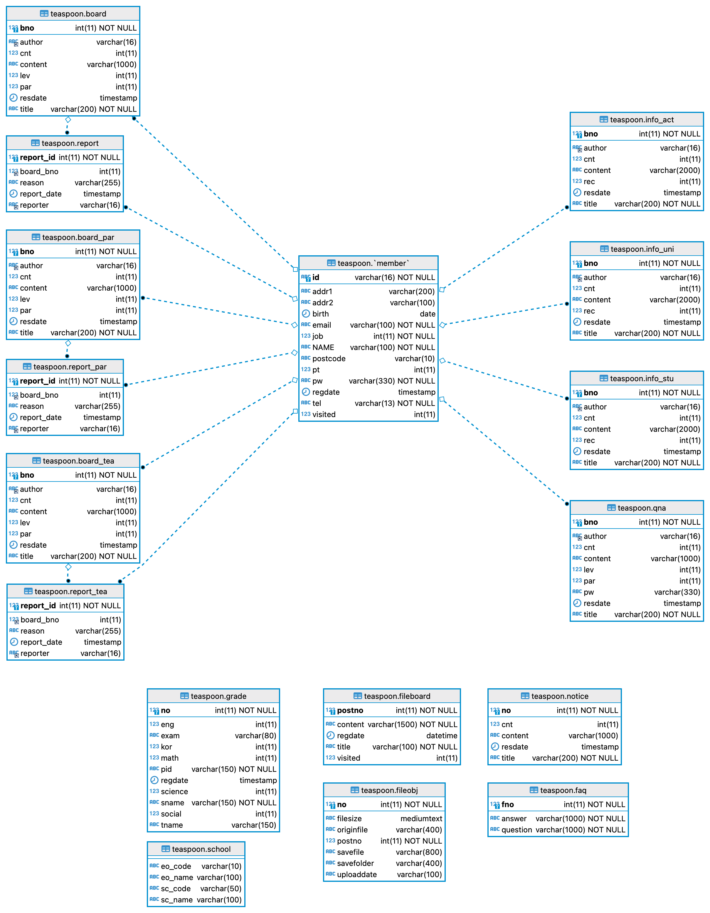
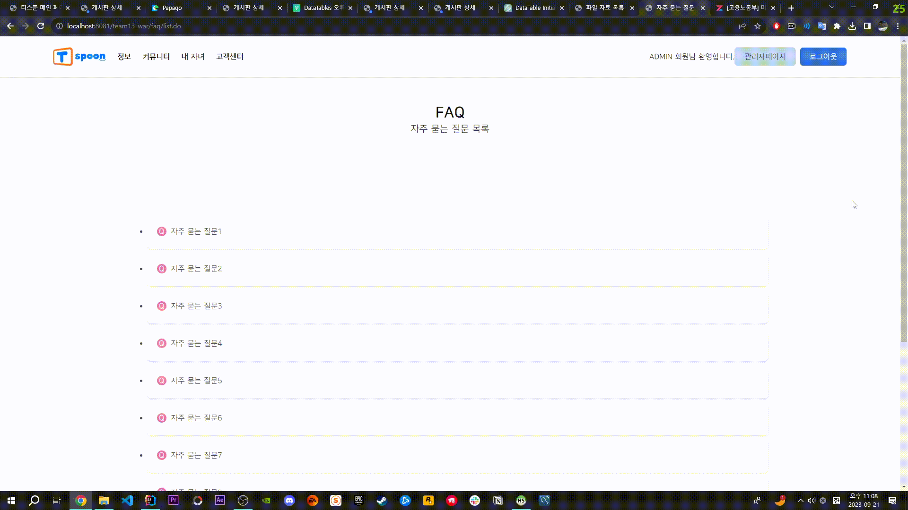
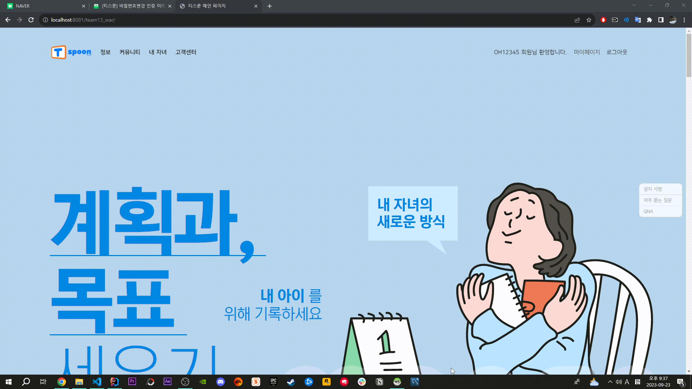
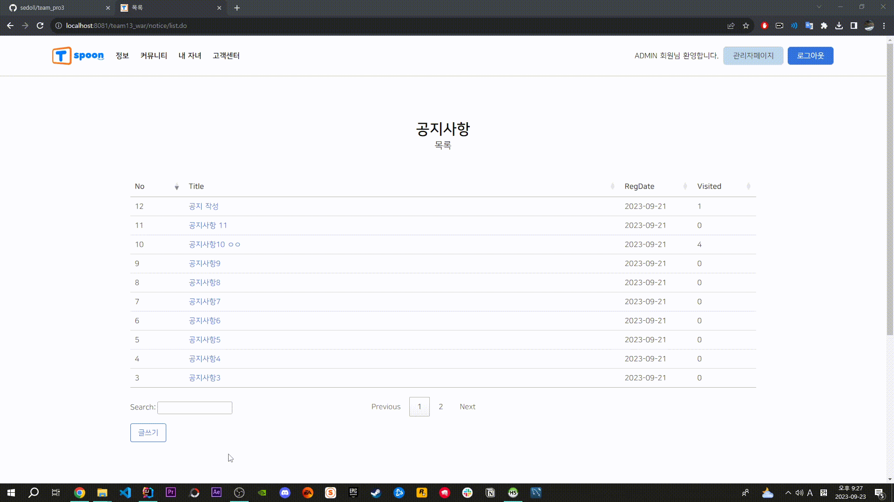
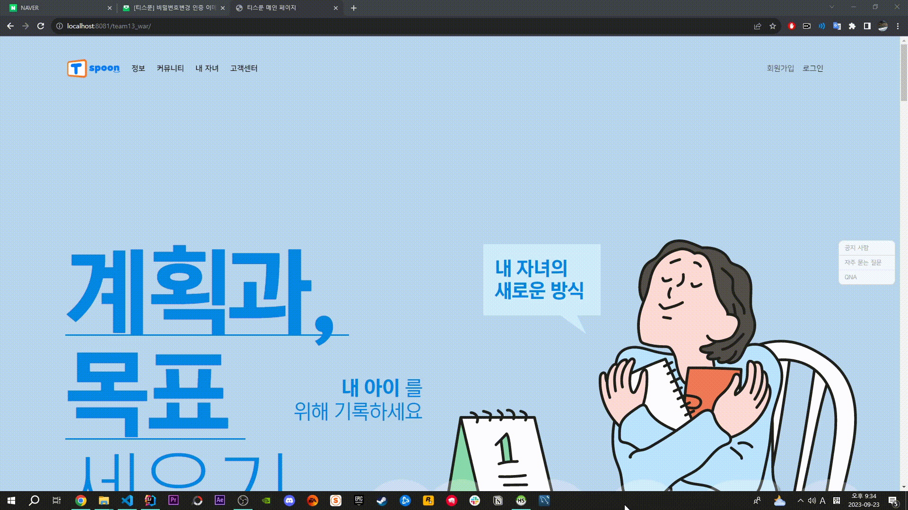
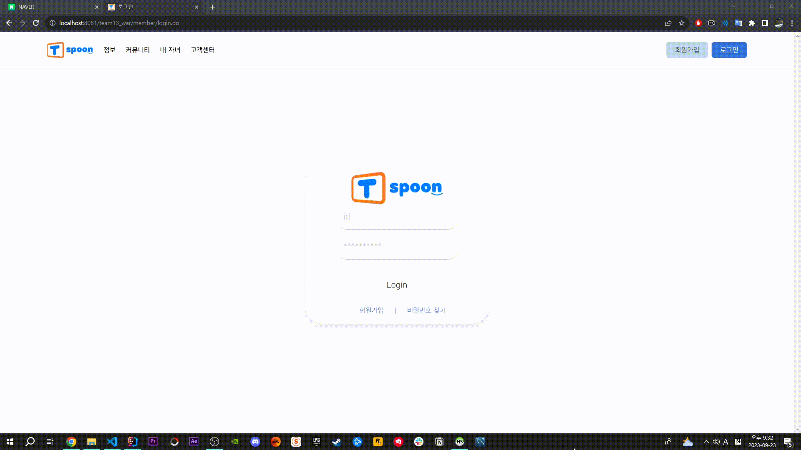
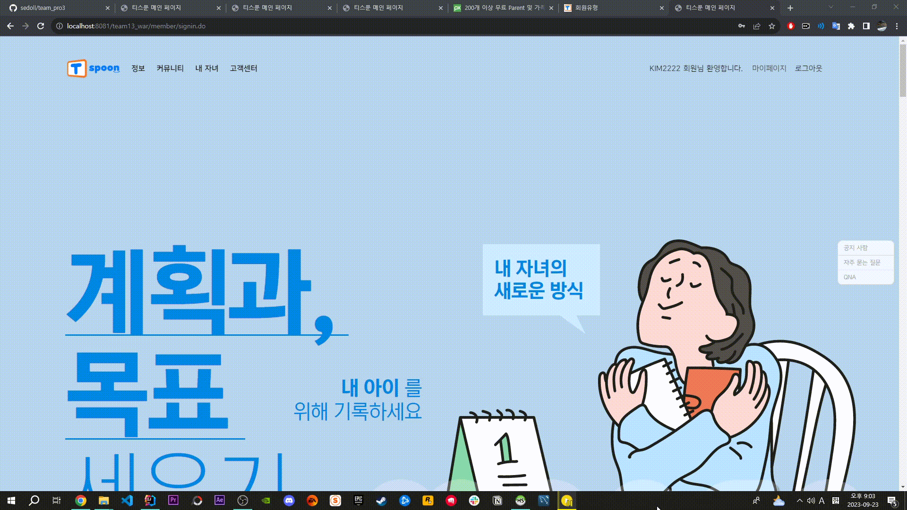

# &nbsp;&nbsp;&nbsp;&nbsp;&nbsp;&nbsp;&nbsp;&nbsp;&nbsp;&nbsp;&nbsp;&nbsp;&nbsp;&nbsp;&nbsp;&nbsp;&nbsp;&nbsp;&nbsp;&nbsp;&nbsp;&nbsp;&nbsp;&nbsp;&nbsp;&nbsp;천재교육 풀스택 과정 3차 프로젝트 
 

&nbsp;&nbsp;&nbsp;&nbsp;&nbsp;&nbsp;&nbsp;&nbsp;&nbsp;&nbsp;&nbsp;&nbsp;&nbsp;&nbsp;&nbsp;&nbsp;&nbsp;&nbsp;&nbsp;&nbsp;&nbsp;&nbsp;&nbsp;&nbsp;&nbsp;&nbsp;&nbsp;&nbsp;&nbsp;&nbsp;&nbsp;&nbsp;&nbsp;&nbsp;&nbsp;&nbsp;&nbsp;&nbsp;&nbsp;&nbsp;&nbsp;&nbsp;&nbsp;&nbsp;&nbsp;&nbsp;&nbsp;&nbsp;&nbsp;&nbsp;&nbsp;&nbsp;&nbsp;&nbsp;&nbsp;&nbsp;&nbsp;&nbsp;&nbsp;&nbsp;
​
  
​
# 📂 프로젝트 소개 
​
안녕하세요!  
**Tspoon**은 학부모들을 위한 온라인 커뮤니티 플랫폼으로, 
양육과 교육에 관한 정보를 공유하고 상호 지원하는 공간을 제공합니다.  
​  
학부모들이 자녀의 성장과 교육 과정을 더욱 효과적으로 관리하고,  
다른 학부모와 경험을 나누며,  유익한 자원을 활용하여
 **함께 성장할 수 있는 플랫폼을 제공**하는 것이   
 저희 팀의 기획의도 입니다.  
    
 
### &nbsp;&nbsp;&nbsp;&nbsp;&nbsp;&nbsp;&nbsp;&nbsp;&nbsp;&nbsp;&nbsp;&nbsp;&nbsp;&nbsp;&nbsp;&nbsp;&nbsp;&nbsp;&nbsp;&nbsp;&nbsp;&nbsp;&nbsp;&nbsp;&nbsp;&nbsp;&nbsp;&nbsp;&nbsp;&nbsp; 🔹 TSPOON 🔹에 대해 자세히 설명해 드릴게요!
### &nbsp;&nbsp;&nbsp;&nbsp;&nbsp;&nbsp;&nbsp;&nbsp;&nbsp;&nbsp;&nbsp;&nbsp;&nbsp;&nbsp;&nbsp;&nbsp;&nbsp;&nbsp;&nbsp;&nbsp;&nbsp;&nbsp;&nbsp;&nbsp;&nbsp;&nbsp;&nbsp;&nbsp;&nbsp;&nbsp;&nbsp;&nbsp;&nbsp;&nbsp;&nbsp;&nbsp;&nbsp;&nbsp;&nbsp;&nbsp;&nbsp;&nbsp;&nbsp;&nbsp;&nbsp;&nbsp;&nbsp;&nbsp;&nbsp;&nbsp;&nbsp;&nbsp;&nbsp;&nbsp;&nbsp;&nbsp;[🙋‍♀️  CLIKE ME  🙋]
 
  
​
​
​
  
​
# 👤 팀원 소개
백준철 - **리더**    &nbsp;&nbsp;관리자 관련 기능 구현, 게시글 신고 기능 구현  
구예진 -  **팀원**   &nbsp;&nbsp;회원 관련 기능 구현, 이메일 인증 기능 구현 
신승원 -  **팀원**   &nbsp;&nbsp;템플릿 및 전체 CSS 담당, 성적표 게시판 기능 구현  
박진권 -  **팀원**   &nbsp;&nbsp;FAQ 게시판 기능 구현, 공지사항 기능 구현 
오세훈 - **깃마스터**    &nbsp;&nbsp;급식 API 관련 기능 구현, 게시판 담당 
​
 
​
# 🗓 개발일정
2023.09.11 - 2023.09.22
​
 
​
#  🔨 개발스택
### 주요언어
 

 
 
​
​
​
​
​
​
### 개발환경
  

   
​
 
​
​
​
​
#  👨‍👨 협업 방식
**✔ 언제든 자유롭게 의견내기, 단 강요는 ��‍♂️**   
​
✔   
&nbsp;&nbsp;**개발에 관련된 모든 자료를 공유하며 과정를 기록합니다.**  
​
✔ </a>
&nbsp;&nbsp;**개발 과정에서 발생하는 모든 이슈를 공유하며 협력하여 해결할 수 있도록 합니다.**
​
 
​
 
​
​

# 📅 WBS

​
#  📊 데이터베이스 설계
​
## 1️⃣ 요구사항 분석
🔹비회원🔹 

🔹회원🔹 

🔹관리자🔹 

  
​
## 2️⃣ 개념적 설계
​
### 🔹유즈케이스 (USE CASE)

​
​
## 3️⃣ 논리적 설계
🔹Board🔹 
  
🔹faq🔹 
  
🔹fileboard🔹 
 
🔹fileinfo🔹 
  
🔹fileobj🔹 
  
🔹grade🔹 
  
🔹info1🔹 
 
🔹member🔹 
 
🔹notice🔹 
 
🔹qna🔹 
 
🔹school🔹 
 

​
## 4️⃣ 물리적 설계 － ＥＲＤ

​
 
 
​
# 📐  클래스 다이어그램
🔹Board🔹 
 
🔹Faq🔹 
 
🔹FileDownLoad🔹 
 
🔹Grade🔹 
 
🔹Info🔹 
 
🔹Member🔹 
 
🔹Menu🔹 
 
​🔹Notice🔹 
 
🔹Qna🔹 

 
​
 
​
​
​
 
​
#  💻 화면 설계도
🔹메인페이지🔹

🔹FAQ🔹

🔹QnA🔹

🔹QnA글쓰기🔹

🔹QnA상세보기🔹

🔹공지사항🔹

🔹공지사항글쓰기 🔹

🔹공지사항상세보기🔹

🔹관리자페이지개인정보변경🔹

🔹관리자페이지게시판관리🔹

🔹관리자페이지댓글관리🔹

🔹관리자페이지회원관리🔹

🔹교육정보🔹

🔹교육정보글쓰기🔹

🔹교육정보상세보기🔹

🔹대입정보🔹

🔹대입정보글쓰기🔹

🔹대입정보상세보기🔹

🔹마이페이지🔹

🔹마이페이지내가쓴글🔹

🔹마이페이지내가쓴댓글🔹

🔹자유게시판🔹

🔹자유게시판글쓰기🔹

🔹자유게시판상세보기🔹

🔹회원가입🔹

 

# 결과 이미지
🔹메인페이지🔹

🔹term🔹

🔹join🔹

🔹login🔹

🔹비밀번호 찾기🔹

🔹FAQ🔹

🔹QnA🔹

🔹QnA 상세🔹

🔹QnA비밀번호 입력🔹

🔹공지사항🔹

🔹공지사항 상세🔹

🔹공지사항 수정🔹

🔹커뮤니티 게시판🔹

🔹커뮤니티 게시판 작성🔹

🔹커뮤니티 게시판 상세🔹

🔹정보 게시판🔹

🔹정보 게시판 작성🔹

🔹정보 게시판 상세🔹

🔹자료실 작성🔹

🔹뉴스🔹

🔹식단표🔹

🔹성적표🔹

🔹성적표 상세🔹

🔹성적표 수정🔹

🔹관리자 페이지 메인🔹

🔹회원목록🔹

🔹회원목록 수정🔹

🔹게시판 글 관리🔹

🔹게시판 댓글 관리🔹

🔹게시판 신고 내역🔹

 

# 결과 gif
🔹메인🔹

🔹FAQ🔹

🔹QNA🔹

🔹게시글신고🔹

🔹공지사항🔹

🔹관리자페이지🔹

🔹뉴스게시판🔹

🔹로그인🔹

🔹마이페이지🔹

🔹비밀번호변경🔹

🔹성적표🔹

🔹식단표🔹

🔹자료실🔹

🔹정보게시판🔹

🔹커뮤니티게시판🔹

🔹회원가입🔹
